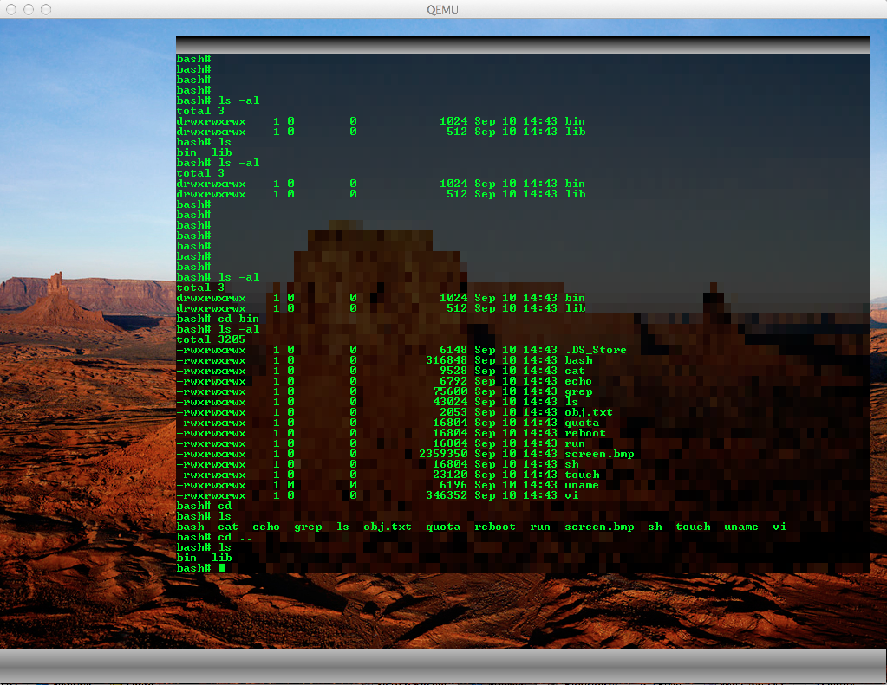
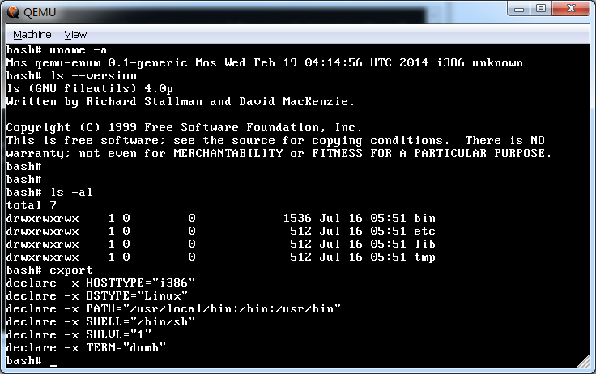
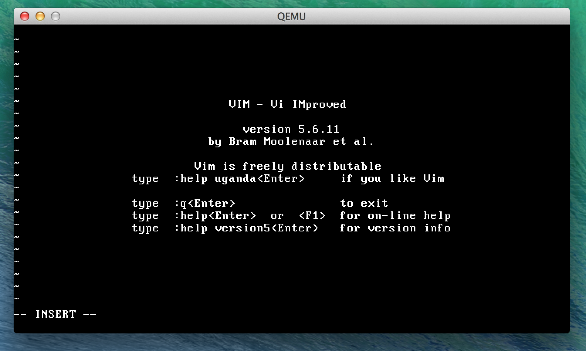
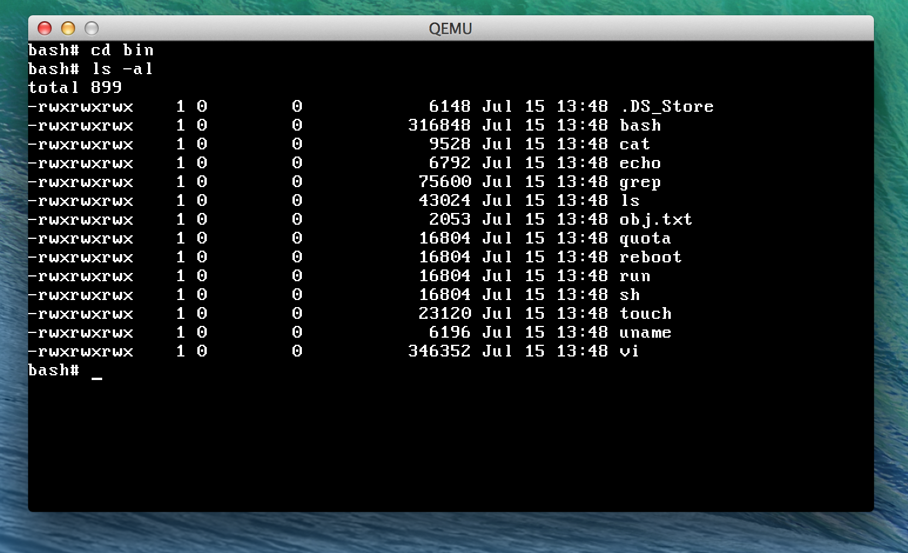
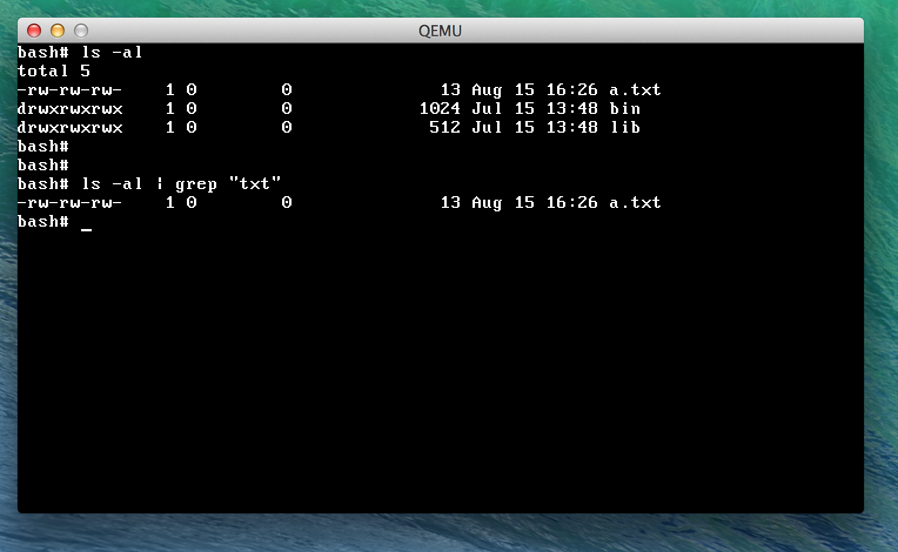

mkernel
=======

Build:   
  make clean & make

Run:   
  ./run.sh
  
Debug:   
  ./run.sh debug // establish a gdb server and wait for remote debug   
  ./run.sh logtofile // write logs into file krn.log   

   
   
   
   
   
